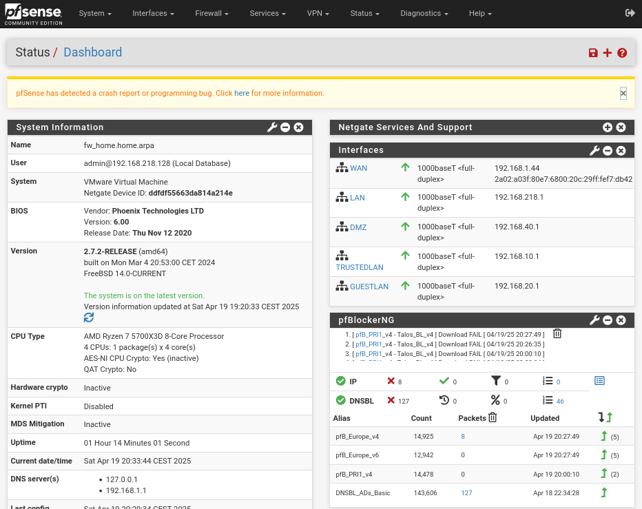

# Securing Networks with pfSense: WAN, LAN, and DMZ Segmentation

## Overview

This project demonstrates the design and deployment of a segmented network using **pfSense** as the firewall and routing platform.

The environment was built in **VMware Workstation** and consists of separate **WAN**, **LAN**, and **DMZ** networks. Since VMware Workstation does not support VLAN tagging in this setup, each network was isolated using its own virtual network adapter.

The lab focuses on:

- Network segmentation
- Stateful firewall policies
- DMZ isolation
- GeoIP filtering with pfBlockerNG
- Intrusion prevention with Suricata (IPS)

---

# Lab Architecture

| Component | Purpose |
|-----------|---------|
| **Hypervisor** | VMware Workstation |
| **Firewall** | pfSense Community Edition |
| **LAN Client** | Debian |
| **DMZ Host** | Kali Linux |

## Network Layout

| Interface | Address | Purpose |
|----------|----------|---------|
| **WAN** | DHCP | Internet connectivity |
| **LAN** | `192.168.218.1/24` | Internal trusted network |
| **DMZ** | `192.168.40.1/24` | Public-facing services |


---

# Interface Configuration

## WAN

- DHCP from upstream network
- Default gateway assigned automatically

## LAN

- Trusted internal network
- DHCP range: `.100 - .200`

## DMZ

- Isolated subnet
- DHCP range: `.100 - .200`

| LAN Interface | DMZ Interface |
|---|---|
|  |  |

---

# Firewall Policies

The firewall is configured using a default-deny approach between security zones.

## LAN

- Allow outbound Internet access
- Allow required DNS/DHCP traffic
- Block direct access to the DMZ

## DMZ

- Allow HTTP/HTTPS traffic through port forwarding
- Block connections to the LAN
- Allow limited outbound traffic for DNS and updates

| LAN Rules | DMZ Rules |
|---|---|
|  |  |

---

# GeoIP Filtering (pfBlockerNG)

pfBlockerNG was configured to block traffic from selected geographic regions before it reached internal services.

Configuration steps:

1. Install pfBlockerNG
2. Enable GeoIP databases
3. Create GeoIP aliases
4. Apply firewall rules using the aliases

| GeoIP Configuration | Country Selection |
|---|---|
|  |  |

## Validation

Traffic to `yandex.ru` was tested before and after enabling the GeoIP rules.

### Before


### After


---

# Intrusion Prevention (Suricata)

Suricata was deployed in **Inline IPS mode** on the **LAN** and **DMZ** interfaces.

Running the IPS behind the firewall allows it to inspect legitimate traffic instead of wasting resources processing unsolicited Internet scans that the firewall already blocks.

Configuration highlights:

- Inline IPS mode
- Netmap acceleration
- Emerging Threats Open ruleset
- Automatic packet blocking

## Validation

Sending a test payload containing:

```
curl -d 'uid=0(root)'
```

triggered the following Suricata alert:

```
GPL ATTACK_RESPONSE id check returned root
```

confirming that the traffic was detected and blocked.

---

# Verification

| Source | Destination | Expected Result |
|---------|-------------|-----------------|
| LAN | WAN | ✅ Allowed |
| LAN | DMZ | ❌ Blocked |
| DMZ | WAN | ✅ Allowed |
| DMZ | LAN | ❌ Blocked |
| WAN | DMZ (HTTP/HTTPS) | ✅ Allowed |

---

# Dashboard



---

# What I Learned

Building this lab improved my understanding of:

- Network segmentation
- pfSense firewall configuration
- Stateful firewall design
- DMZ architecture
- pfBlockerNG
- GeoIP filtering
- Suricata IPS
- Network policy validation
- Virtual network design in VMware
