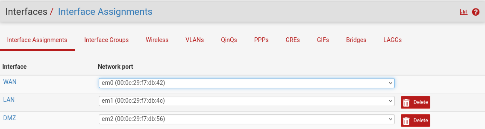
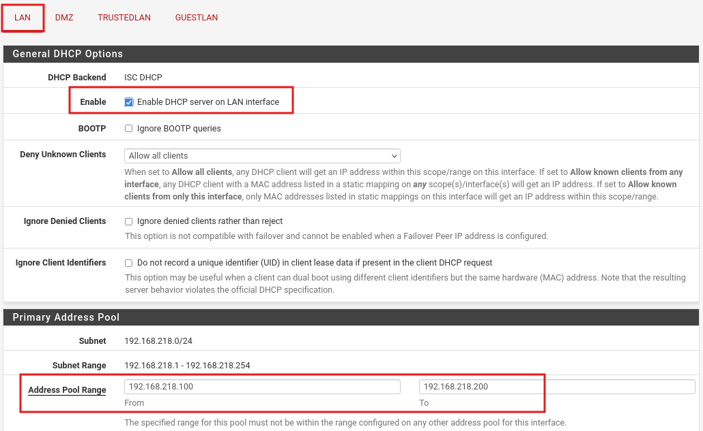
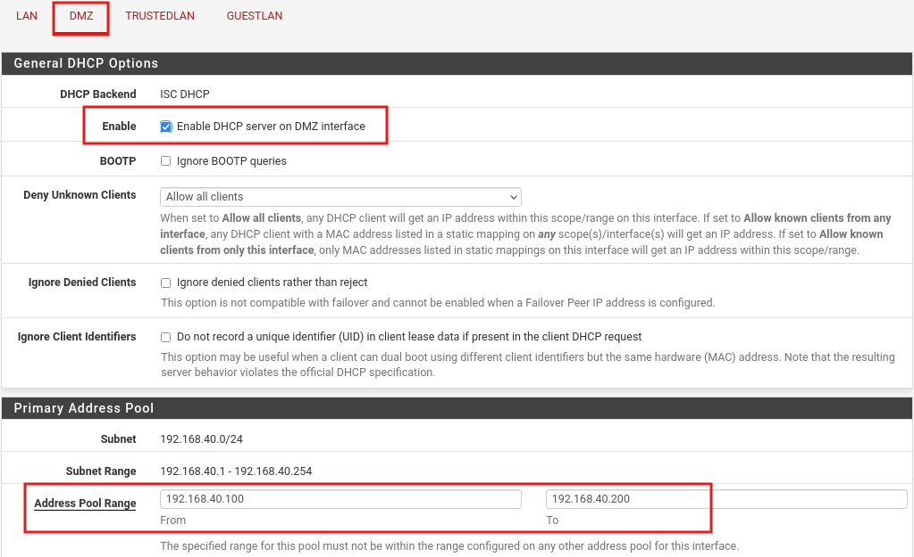
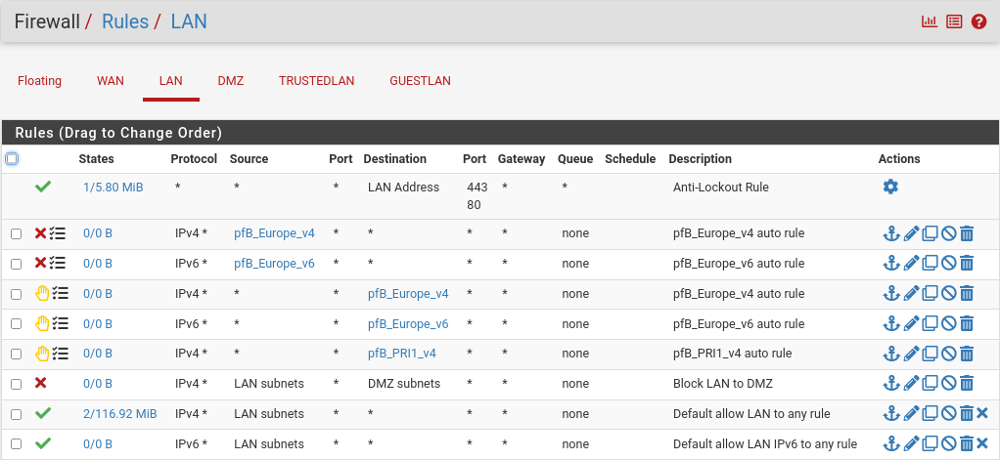
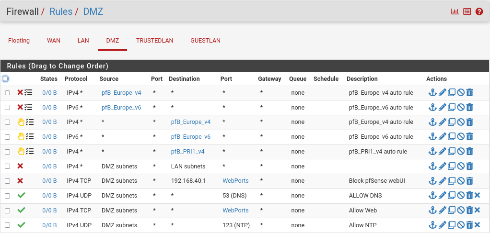
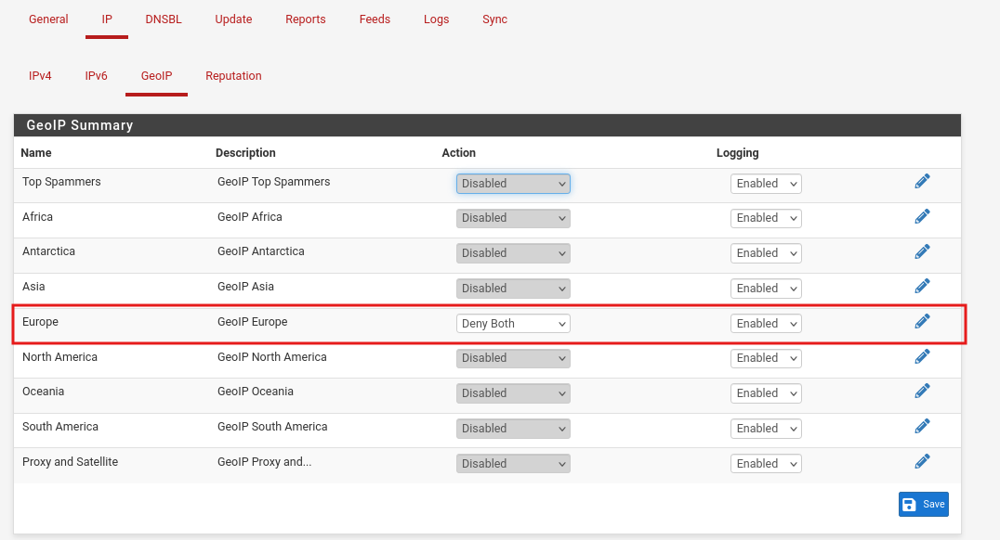
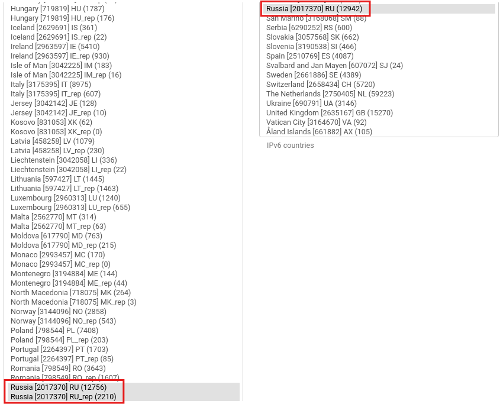
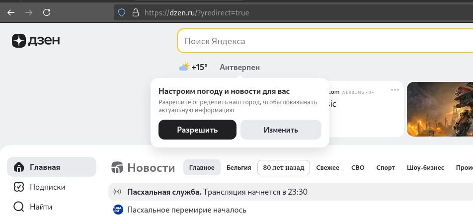
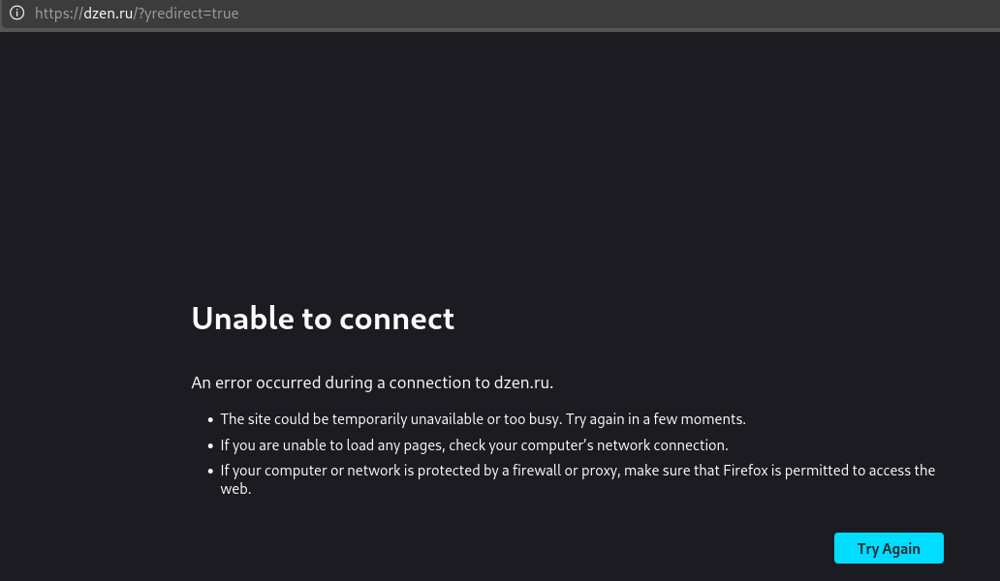

# Securing Networks with pfSense: WAN, LAN, and DMZ Segmentation

## Architecture & Project Overview
This project focuses on the design and deployment of a segmented, secure network topology using **pfSense** as the core edge firewall and routing platform. The entire architecture was virtualized within **VMware Workstation**. Due to hypervisor limitations regarding native VLAN tagging, hard physical interface isolation was achieved by provisioning **three separate virtual NICs** mapped to dedicated host-only networks.

The primary objective was to build a resilient, production-ready Small-to-Medium Business (SMB) network layout featuring strict zone separation, automated perimeter GeoIP filtering, and deep packet inspection (DPI) via Suricata running in inline IPS mode.

---

## Lab Setup & Interface Topology

* **Hypervisor Layer:** VMware Workstation
* **Firewall Appliance:** pfSense Community Edition
* **Target Test Endpoints:** 
  * LAN Client: Debian Endpoint
  * DMZ Server: Kali Testing Machine

### Subnet Allocations & vNIC Mapping
* **WAN (NIC 1):** Configured via upstream physical DHCP bridging for direct internet access.
* **LAN (NIC 2):** Static IP `192.168.218.1/24` — Dedicated internal trusted segment with an active DHCP scope (`.100` to `.200`).
* **DMZ (NIC 3):** Static IP `192.168.40.1/24` — Isolated DMZ staging layer for public-facing utilities with an active DHCP scope (`.100` to `.200`).

---

## Interface & Routing Configurations

### WAN Boundary
* Upstream physical bridging with dynamic interface addressing.
* Automated assignment of the default system gateway.

### Internal Segments
* **LAN Layout:** Enforces explicit segregation parameters for internal corporate infrastructure assets.
* **DMZ Layout:** Enforces strict containment controls around untrusted, public-facing services.

| Interface Management | Scope Definitions |
|---|---|
|  |  |

---

## Firewall Policy Design

Strict stateful packet filtering policies were implemented to enforce proper zone containment and prevent unauthorized lateral movement across the network stack.

### LAN Policy Set
* Permitted full outbound state tracking to the WAN interface for general internet access.
* Enforced an absolute **Implicit Deny** rule blocking all ingress and traversal attempts toward the DMZ block.
* Whitelisted internal infrastructure access for necessary DNS/DHCP local routing.

### DMZ Policy Set
* Permitted structured inbound traffic (HTTP/HTTPS tracking) originating from the WAN edge via explicit port forwarding.
* Enforced a hard isolation boundary blocking **all** connection states initiating from the DMZ toward the internal LAN.
* Provisioned restricted outbound paths exclusively for external DNS resolution.

| LAN Rule Infrastructure | DMZ Isolation Layers |
|---|---|
|  |  |

---

## Perimeter Engineering: Edge GeoIP Filtering

To drastically reduce the public exposure vector of the DMZ infrastructure against automated brute-force scripts and foreign reconnaissance scanners, **pfBlockerNG** was integrated into the firewall edge layer.

### Rule Execution Pipeline
1. Provisioned the pfBlockerNG package and activated the GeoIP tracking modules.
2. Built custom network aliases targeted at high-risk regional IP pools.
3. Enforced explicit drop policies on all inbound and outbound traffic strings communicating with restricted domains (e.g., automated dropping of connection requests targeting network spans in the Russian Federation).

| GeoIP Alias Mapping | Country Code Targeting |
|---|---|
|  |  |

### Boundary Verification Testing
Policy enforcement was validated by verifying DNS and routing handshakes before and after activating the GeoIP drop rules against a top-level domain host (`yandex.ru`).

* **Pre-Enforcement (Connection Allowed):**

* **Post-Enforcement (Traffic Dropped at Perimeter):**

---

## Deep Packet Inspection: Inline IPS Engine via Suricata

Rather than placing the IDS/IPS engine directly on the WAN interface—which induces heavy CPU thrashing by processing thousands of junk automated external scans that pfSense already drops by default—**Suricata was deployed exclusively on the LAN and DMZ interfaces**. This architectural layout ensures the engine inspects actual, post-filtered corporate traffic.

### Engineering Highlights
* **Operational Mode:** **Inline IPS Execution** utilizing native **Netmap Kernel Acceleration (Workers Mode)** to provide true runtime packet dropping capabilities rather than passive, out-of-band alerts.
* **Rule Engine Optimization:** Evaluated connections using the **Emerging Threats (ET) Open Ruleset**, with optimized rule flags to drop active threat signatures including Nmap scanning behavior, malformed data streams, and suspicious shellcode patterns.

### Threat Detection Validation
Executing an aggressive inbound web payload string containing an unauthenticated root command query (`curl -d 'uid=0(root)'`) immediately triggered a kernel socket layer trap:

Alert: GPL ATTACK_RESPONSE id check returned root -> [Automated DROP Logged]

---

## Verification & Isolation Matrix

| Source Zone | Destination Zone | Protocol / Service | Expected Action | Result |
| --- | --- | --- | --- | --- |
| **LAN** | WAN | Any | **ALLOW** | ✅ Pass |
| **LAN** | DMZ | Any | **DENY** | ❌ Blocked (As Expected) |
| **DMZ** | WAN | Any | **ALLOW** | ✅ Pass |
| **DMZ** | LAN | Any | **DENY** | ❌ Blocked (As Expected) |
| **WAN** | DMZ | HTTP/HTTPS (Port-Forwarded) | **ALLOW** | ✅ Pass |

